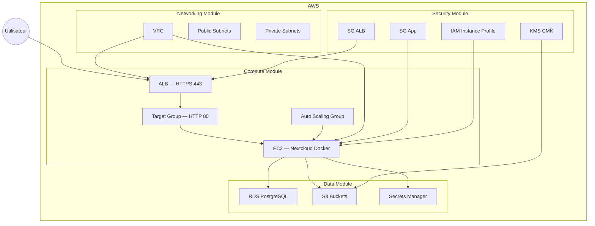

# ARCHITECTURE KOLAB - NEXTCLOUD IAAC
 
## 1. Vue d'ensemble
 
L'infrastructure Kolab est une architecture AWS entièrement automatisée via Terraform.
 
Elle est composée de 4 modules principaux :
 
- networking → VPC, subnets, NAT
- security → SG, IAM, KMS, Secrets Manager
- data → RDS PostgreSQL + S3
- compute → ALB + ASG + EC2 Nextcloud
 
---
 
## 2. Schéma global (Mermaid)

 
## 3. Décisions d'architecture
 
#### 1. Auto Scaling uniquement pour HA
Le ASG est configuré en min=1 / desired=1 / max=2 afin de :
 
- assurer la haute disponibilité
- permettre le remplacement automatique en cas de crash
- éviter les problèmes de session Nextcloud sans Redis
 
#### 2. TLS auto-signé
Un certificat auto-signé est généré via le provider TLS.
 
- simplifie le TP
- évite la dépendance DNS / Route53
- accepté uniquement en environnement dev
 
#### 3. Stockage externalisé via S3
Nextcloud utilise S3 comme stockage principal :
 
- scalabilité illimitée
- découplage compute / data
- sécurité renforcée via IAM instance profile