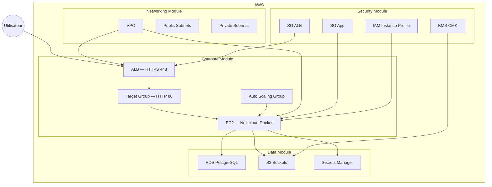

# RENDU — TP05 — Nextcloud sur AWS
 
> **Instructions de remplissage** : ce fichier est le `docs/RENDU.md` à livrer dans votre zip. Copiez-le tel quel dans votre repo à la racine de `docs/RENDU.md`, puis remplissez **toutes** les sections ci-dessous. Les `<!-- remplir ici -->` et les `TODO` doivent avoir disparu à la remise.
 
---
 
## 🟥 Rappel critique — avant de zipper
 
> 🟥 **Ne jamais committer** :
>
> - `*.tfvars` (sauf les `*.tfvars.example`)
> - `*.tfstate` et `*.tfstate.backup`
> - Le dossier `.terraform/`
> - Aucun mot de passe en clair (DB, admin Nextcloud, clé AWS, token GitHub)
> - Aucune clé privée (`*.pem`, `id_rsa`, etc.)
>
> 🔹 Vérifiez une dernière fois avant le zip :
>
> ```bash
> cd tp05-nextcloud
> grep -rE "(password|secret|AKIA)" --include="*.tf" --include="*.tfvars" . | grep -v example
> # Doit retourner 0 ligne
> ```
 
---
 
## Section 1 — Identification de l'équipe
 
**Numéro d'équipe** : `equipe6`
**Nom de code de l'équipe** *(optionnel)* : `TODO`
**Date de rendu** : `2026-04-16`
 
### Membres
 
| Prénom Nom | Rôle assigné | Email | Compte GitHub |
|------------|--------------|-------|---------------|
| `Ismail CAWNI` | Platform Lead (Rôle 1) | `i.cawni@ecole-ipssi.net` | `@icawni14` |
| `Maxime LAIGLE` | Network Engineer (Rôle 2) |`m.laigle@ecole-ipssi.net ` |`@PrincesseVoiture `|
| `Ismail CAWNI` | Compute Engineer (Rôle 3) | `i.cawni@ecole-ipssi.net` | `@icawni14` |
| `Maxime LAIGLE` | Data Engineer (Rôle 4) |`m.laigle@ecole-ipssi.net ` |`@PrincesseVoiture `|
| `Antoine GINFRAY` | Security Engineer (Rôle 5) | a.ginfray@ecole-ipssi.net` | `@aginfray10 `|
 
> 🔷 Équipe à 4 personnes : indiquez qui a fusionné le rôle Security dans le rôle Platform.
>
> C'est Maxime qui s'est occupé de la fusion
 
---
 
## Section 2 — Résumé architecture
 
**En 5 lignes maximum**, décrivez l'infrastructure déployée (couches, AZ, interactions principales).
 
> Infrastructure AWS en 3 couches : networking (VPC avec subnets publics pour l’ALB et privés pour les EC2), sécurité (SG, IAM, KMS et Secrets Manager), et application (ALB → ASG → EC2 Docker Nextcloud). L’ALB public en HTTPS répartit le trafic vers les instances privées sur plusieurs AZ pour la haute disponibilité. Les EC2 accèdent à RDS PostgreSQL, S3 et Secrets Manager pour les données et secrets. L’ASG assure l’auto-recovery des instances en cas de panne.
  
### Schéma Mermaid
 

 
 
---
 
## Section 3 — Arbitrages techniques réalisés
 
Listez **au minimum 3 arbitrages** que vous avez faits pendant le TP (choix structurant, alternative considérée, raison du choix, conséquence).
 
### Arbitrage 1
 
- **Choix retenu** : `ALB public avec EC2 en sous-réseaux privés`
- **Alternative envisagée** : `Exposer directement les EC2 en public (IP publique)`
- **Raison** : `Réduction de la surface d’attaque et respect du modèle AWS “public entry / private compute”.`
- **Conséquence / limite** : `Complexité réseau plus élevée (NAT, routage), debug plus difficile.`
 
 
### Arbitrage 2
 
- **Choix retenu** : `Certificat TLS auto-signé via tls + import ACM`
- **Alternative envisagée** : `Certificat ACM public avec nom de domaine réel`
- **Raison** : `Raison : Contraintes TP sans domaine DNS public, besoin de HTTPS fonctionnel rapidement.`
- **Conséquence / limite** : `Alerte navigateur “connexion non sécurisée” à accepter manuellement.`
 
 
### Arbitrage 3
 
- **Choix retenu** : `ASG avec min=1 / desired=1 / max=2 (pas de scaling horizontal réel)`
- **Alternative envisagée** : `Cluster multi-instances actives derrière ALB`
- **Raison** : `Nextcloud sans Redis ne supporte pas correctement le multi-instance (sessions + file locking).`
- **Conséquence / limite** : `Pas de haute disponibilité réelle applicative, seulement auto-recovery.`
 
 
---
 
## Section 4 — Retour sur les interfaces inter-modules
 
Les interfaces (variables + outputs) étaient figées au kick-off. Répondez aux questions suivantes.
 
**Quelle interface a été la plus délicate à stabiliser ?**
 
> L’interface entre les modules security et data, à cause de la dépendance croisée entre le KMS (côté security) et les buckets S3 (côté data). Le module security avait besoin des ARN S3 pour définir certaines politiques IAM, tandis que le module data dépendait du KMS pour le chiffrement des buckets. Cette dépendance a nécessité un passage en “late binding” via les outputs des modules.
 
<!-- remplir ici -->
 
**Avez-vous dû modifier une interface en cours de route ? Si oui, laquelle et pourquoi ?**
 
> Oui, principalement l’interface du module security, avec ajustement des outputs et suppression de certains éléments non implémentés (Secrets Manager / IAM incomplets au début). Cela a été nécessaire pour rester aligné avec les ressources réellement livrées et éviter des références cassées dans le module compute.
 
<!-- remplir ici -->
 
**Qu'est-ce qui a le mieux fonctionné dans la collaboration inter-modules ?**
 
> Le fait d’avoir des interfaces figées dès le départ (variables.tf + outputs.tf) a permis à chaque rôle de travailler en parallèle. Même avec des modules non encore implémentés, l’utilisation de valeurs attendues et d’outputs contractuels a permis de construire l’architecture globale sans blocage.
 
<!-- remplir ici -->
 
**Qu'est-ce qui a bloqué ?**
 
> Les principaux blocages ont été liés aux désalignements entre interfaces et implémentation réelle des modules, notamment les outputs référencés mais non encore créés, ainsi que les erreurs de dépendances Terraform lors de l’intégration initiale. Cela a nécessité plusieurs ajustements et revalidation avec terraform validate.
 
---
 
## Section 5 — Résultats `terraform plan` et `terraform apply`
 
Collez ici les **résumés** (pas les sorties complètes) des commandes finales exécutées depuis `envs/dev/`.
 
### `terraform plan` final
 
```text
...
  # module.security.random_password.db will be created
  + resource "random_password" "db" {
      + bcrypt_hash = (sensitive value)
      + id          = (known after apply)
      + length      = 24
      + lower       = true
      + min_lower   = 0
      + min_numeric = 0
      + min_special = 0
      + min_upper   = 0
      + number      = true
      + numeric     = true
      + result      = (sensitive value)
      + special     = false
      + upper       = true
    }

Plan: 71 to add, 0 to change, 0 to destroy.

Changes to Outputs:
  + admin_password_secret_arn = (known after apply)
  + alb_dns_name              = (known after apply)
  + asg_name                  = "kolab-dev-asg"
  + db_endpoint               = (known after apply)
  + db_password_secret_arn    = (known after apply)
  + nextcloud_url             = (known after apply)
  + s3_logs_bucket_name       = (known after apply)
  + s3_primary_bucket_name    = (known after apply)
  + vpc_id                    = (known after apply)

────────────────────────────────────────────────────────────────────────────────────────────────────────────────────────────────────────

Saved the plan to: tfplan

To perform exactly these actions, run the following command to apply:
    terraform apply "tfplan"
```
 
### `terraform apply` final
 
```text
Apply complete! Resources: <!-- N --> added, <!-- N --> changed, <!-- N --> destroyed.
 
Outputs:
 
alb_dns_name  = "<!-- remplir -->"
nextcloud_url = "<!-- remplir -->"
db_endpoint   = "<!-- remplir -->"
# ... autres outputs
```
 
### Nombre total de ressources déployées
 
**Total** : `<!-- N -->` ressources
 
> 🔷 Ce nombre doit correspondre à ce qui est visible dans `02-apply-success.png`.
 
---
 
## Section 6 — Checklist des 5 screenshots obligatoires
 
Les captures doivent être dans `docs/screenshots/` au format PNG. Cochez chaque case quand le fichier est présent ET lisible.
 
- [x] `01-plan-dev.png` — sortie de `terraform plan` avec la ligne `Plan: N to add, ...` visible
- [x] `02-apply-success.png` — sortie `Apply complete! Resources: N added.` + les outputs visibles
- [ ] `03-nextcloud-login.png` — page de login Nextcloud dans le navigateur avec l'URL ALB visible dans la barre d'adresse
- [ ] `04-file-in-s3.png` — console AWS S3 montrant un fichier uploadé depuis Nextcloud, avec le chiffrement KMS visible dans les propriétés
- [ ] `05-destroy-success.png` — sortie `Destroy complete! Resources: N destroyed.`
 
> 🟡 Piège courant : les screenshots avec informations sensibles visibles. Avant de les coller dans le zip, floutez les IP publiques personnelles, les tokens, les clés AWS complètes.
 
> 🔹 Astuce : si une capture contient un mot de passe admin Nextcloud en clair (généré puis affiché), régénérez-la avec le mot de passe masqué ou ne l'incluez pas.
 
---
 
## Section 7 — Coût estimé
 
Estimez le coût de l'infrastructure pour 24h de fonctionnement (dev). Utilisez Infracost si possible, sinon faites un calcul manuel à partir de la [page de tarification AWS eu-west-1](https://aws.amazon.com/ec2/pricing/on-demand/).
 
| Ressource | Quantité | Prix unitaire (USD) | Sous-total 24h (USD) |
|-----------|----------|---------------------|----------------------|
| EC2 t3.small | `<!-- N -->` | `<!-- $/h -->` | `<!-- $ -->` |
| ALB | 1 | `<!-- $/h -->` | `<!-- $ -->` |
| NAT Gateway | `<!-- 1 ou 2 -->` | `<!-- $/h -->` | `<!-- $ -->` |
| RDS db.t3.micro Multi-AZ | 1 | `<!-- $/h -->` | `<!-- $ -->` |
| EBS RDS gp3 | `<!-- GB -->` | `<!-- $/GB-mois -->` | `<!-- $ -->` |
| S3 primary + logs | `<!-- GB -->` | `<!-- $/GB-mois -->` | `<!-- $ -->` |
| KMS CMK | 1 | `1.00 / mois` | `<!-- $ -->` |
| Secrets Manager | 2 | `0.40 / secret / mois` | `<!-- $ -->` |
| VPC Endpoints | `<!-- N -->` | `<!-- $/h -->` | `<!-- $ -->` |
| **Total 24h** | | | `<!-- $ -->` |
| **Extrapolation 30 jours** | | | `<!-- $ -->` |
 
> *Exemple : Total 24h ~= 6.10 USD, extrapolation 30 jours ~= 183 USD.*
 
**Méthode utilisée** : `TODO` (Infracost / calculator AWS / estimation manuelle)
 
**Commentaire** :
 
> *Exemple : le NAT Gateway seul représente ~35% du coût — on pourrait le supprimer après le boot initial de Nextcloud en `dev` puisque l'instance n'a plus besoin de sortir d'Internet.*
 
<!-- remplir ici -->
 
---
 
## Section 8 — Rétrospective équipe

### 🟢 3 choses qui ont bien marché

1. Le figement des interfaces Terraform dès le kick-off a permis un travail réellement parallèle entre les rôles.
2. La séparation claire des modules (networking, security, data, compute) a facilité la compréhension globale de l’architecture.
3. L’utilisation de outputs standardisés a permis d’intégrer les modules sans dépendances bloquantes.

---

### 🔴 3 choses qui ont bloqué

1. Les erreurs de dépendances entre modules (notamment security ↔ data) liées aux ARN et au KMS.
2. Les problèmes de credentials AWS et de backend S3 lors du bootstrap initial.
3. Les erreurs de user_data et de debug EC2 qui n’étaient visibles qu’après déploiement réel.

---

### 🔷 3 améliorations pour la prochaine fois

1. Mettre en place tfsec et tflint dès le début du projet (pre-commit).
2. Tester chaque module indépendamment avec des mocks avant intégration globale.
3. Standardiser un environnement de test AWS ou sandbox pour éviter les blocages liés aux credentials et au state.
 
> *Exemple : "Installer tfsec dans le pre-commit dès le matin aurait évité 3 HIGH détectés en fin de journée."*
 
---
 
## Section 9 — Contribution individuelle par rôle
 
**Chaque membre remplit son bloc lui-même.** Soyez honnêtes — cette section sert à l'individualisation de la note.
 
> 🔷 Le hash du commit est obtenu avec `git log --oneline -1 --author="Votre Nom"` ou `git log --format='%h %s' | head -5`.
 
---
 
### Rôle 1 — Platform Lead
 
**Membre** : `Ismail CAWNI`
 
**Ce que j'ai livré** :
 
- envs/dev/backend.tf
- envs/dev/providers.tf
- envs/dev/main.tf (orchestration des modules)
- Revue des PRs des différents rôles (validation des interfaces Terraform)
- Lancement et supervision du terraform apply collectif
 
**Ce qui m'a surpris ou frustré** :
 
> La principale difficulté a été la mise en place du backend S3 avec KMS, notamment les erreurs liées aux alias KMS et aux credentials AWS mal configurés sur la machine locale. Cela a bloqué le bootstrap et retardé les premières étapes d’intégration.
 
**Ce que j'ai appris** :
 
> J’ai compris l’importance de figer les interfaces Terraform dès le début (variables et outputs), car cela permet un travail réellement parallèle entre équipes. J’ai aussi appris la gestion du state Terraform avec backend S3 chiffré et verrouillage natif sans DynamoDB en version récente.

---
 
### Rôle 2 — Network Engineer

**Membre** : Maxime Laigle

**Ce que j'ai livré** :

- `modules/networking/main.tf — VPC + subnets publics/privés + Internet Gateway + NAT Gateway`
- `route tables publiques et privées avec associations par AZ`
- `VPC endpoints S3 (Gateway) et Secrets Manager (Interface)`
- `outputs : vpc_id, public_subnet_ids, private_app_subnet_ids, private_db_subnet_ids`
- `README.md du module (structure + terraform-docs)`

**Ce qui m'a surpris ou frustré** :

> La principale difficulté a été la compréhension des différences entre les VPC endpoints Gateway et Interface. Une mauvaise sélection peut entraîner des coûts inutiles ou une mauvaise connectivité. J’ai également sous-estimé la complexité du routage entre subnets publics et privés avec NAT Gateway.

**Ce que j'ai appris** :

> J’ai appris à concevoir un réseau AWS multi-AZ propre avec séparation stricte public/privé, ainsi que l’importance des NAT Gateways pour l’accès sortant des ressources privées. J’ai aussi compris les impacts coûts/performance des VPC endpoints et leur rôle dans la sécurisation des accès AWS sans exposition Internet.

---
 
### Rôle 3 — Compute Engineer
 
**Membre** : `<!-- Prénom Nom -->`
 
**Ce que j'ai livré** :
 
•	modules/compute/alb.tf — ALB + Target Group + listener HTTPS self-signed
	•	modules/compute/asg.tf — Launch Template + Auto Scaling Group (min=1)
	•	modules/compute/tls.tf — certificat auto-signé via provider tls + import ACM
	•	modules/compute/templates/nextcloud-user-data.sh.tftpl — installation Docker + Nextcloud
	•	modules/compute/outputs.tf — alb_dns_name, nextcloud_url, asg_name
 
**Ce qui m'a surpris ou frustré** :
 
> Le point le plus difficile a été le debug du user_data : une erreur dans le script empêche totalement le démarrage de Nextcloud sans retour direct dans Terraform. J’ai aussi constaté que le health check ALB dépend fortement du temps d’installation (Docker + pull image), ce qui peut retarder la mise en service de plusieurs minutes.
 
 
**Ce que j'ai appris** :
 
J’ai appris à concevoir une architecture complète ALB + ASG en environnement privé, ainsi que l’importance du health_check_grace_period pour éviter les redémarrages prématurés des instances. J’ai aussi compris l’impact critique du user_data dans l’automatisation EC2 et la nécessité d’un script idempotent et observable via logs.

---
 
### Rôle 4 — Data Engineer

**Membre** : Maxime Laigle

**Ce que j'ai livré** :

- `modules/data/rds.tf — RDS PostgreSQL Multi-AZ avec subnet group et parameter group`
- `modules/data/s3.tf — bucket primary Nextcloud + bucket logs ALB avec SSE-KMS, versioning et block public access`
- `outputs : db_endpoint, db_name, s3_primary_bucket_name, s3_logs_bucket_name`
- `README.md du module (documentation et variables principales)`

**Ce qui m'a surpris ou frustré** :

> La configuration de la bucket policy pour les access logs de l’ALB a été la partie la plus délicate, notamment l’identification du bon service principal AWS Elastic Load Balancing et les permissions nécessaires pour `s3:PutObject`. La gestion du chiffrement SSE-KMS a également demandé une bonne compréhension des interactions entre S3 et KMS.

**Ce que j'ai appris** :

> J’ai appris à concevoir une base de données RDS PostgreSQL sécurisée en environnement multi-AZ, ainsi qu’à gérer un stockage S3 conforme aux bonnes pratiques AWS (chiffrement, versioning, blocage public). J’ai également compris l’importance des politiques IAM fines pour permettre des services AWS comme l’ALB d’écrire dans S3 de manière sécurisée.

---
 
### Rôle 5 — Security Engineer
 
**Membre** : `<!-- Prénom Nom — ou "N/A équipe à 4, fusionné avec Rôle 1" -->`
 
**Ce que j'ai livré** :
 
- `<!-- ex: modules/security/sg.tf — 3 SG (alb, app, db) avec aws_vpc_security_group_ingress_rule v5 -->`
- `<!-- ex: modules/security/kms.tf — CMK + alias + rotation activée -->`
- `<!-- ex: modules/security/iam.tf — IAM role EC2 + instance profile + policies scoped S3/Secrets -->`
- `<!-- ex: modules/security/secrets.tf — 2 secrets (db_password, admin_password) générés via random_password -->`
 
**Ce qui m'a surpris ou frustré** :
 
> *Exemple : "La policy IAM avec `Resource` scoped au bucket ARN exact + `${arn}/*` pour les objets — tfsec flag tous les `Resource = *`."*
 
<!-- remplir ici -->
 
**Ce que j'ai appris** :
 
<!-- remplir ici -->
 
**Hash du dernier commit significatif que j'ai fait** : `<!-- ex: a1b2c3d -->`
 
---
 
## Section 10 — Checklist finale avant remise
 
**L'équipe certifie collectivement que** :
 
- [x] `terraform destroy` a été exécuté avec succès dans `envs/dev/` (screenshot `05-destroy-success.png` prouve `Destroy complete!`)
- [ ] La console AWS a été re-vérifiée : aucune EC2, RDS, NAT Gateway, ELB, EIP, Secret Manager, bucket S3 (hors bucket state) ne reste avec les tags de l'équipe
- [x] Aucun fichier `*.tfstate` ou `*.tfstate.backup` n'est présent dans le zip
- [x] Aucun dossier `.terraform/` n'est présent dans le zip
- [x] Aucun fichier `*.tfvars` personnel n'est présent (seul `terraform.tfvars.example` est autorisé)
- [x] Aucun secret en clair (mot de passe DB, admin, access key, token GitHub) n'est dans le code
- [ ] La commande `grep -rE "(password|secret|AKIA)" --include="*.tf" . | grep -v example` retourne 0 ligne
- [ ] Les 5 screenshots obligatoires sont dans `docs/screenshots/`
- [ ] Le fichier `docs/RENDU.md` (ce fichier) est rempli à 100 % — plus aucun `<!-- remplir -->` ni `TODO` résiduel
- [x] Le fichier `ARCHITECTURE.md` contient un schéma Mermaid à jour
- [x] Chaque module dans `modules/` a son `README.md` (minimum : titre + description + inputs/outputs)
- [x] Le fichier `.terraform.lock.hcl` est committé (mais pas `.terraform/`)
- [x] Les commits git sont tracés par auteur (pour la notation individuelle)
- [x] Le zip est nommé exactement `tp05-nextcloud-equipe<N>.zip`
 
### Commande de packaging recommandée
 
```bash
# Depuis la racine du projet
cd ~/formation-terraform/jour5
 
# Nettoyage des artefacts lourds avant zip
find tp05-nextcloud -type d -name ".terraform" -exec rm -rf {} +
find tp05-nextcloud -name "terraform.tfstate*" -delete
find tp05-nextcloud -name "*.tfvars" ! -name "*.tfvars.example" -delete
 
# Verification finale secrets
grep -rE "(password|secret|AKIA)" tp05-nextcloud --include="*.tf" --include="*.tfvars" | grep -v example
# Doit retourner 0 ligne
 
# Zip final (en conservant le .git pour la notation individuelle)
zip -r tp05-nextcloud-equipe<N>.zip tp05-nextcloud/
 
# Verification du contenu
unzip -l tp05-nextcloud-equipe<N>.zip | head -50
```
 
---
 
## Signature de l'équipe
 
**Date de remise** : `2026-04-16 HH:MM`
 
**Signataires** (tous les membres doivent cocher) :
 
- [x] `Ismail CAWNI Rôle 1` — certifie l'exactitude des informations ci-dessus
- [x] `Maxime LAIGLE Rôle 2` — certifie l'exactitude des informations ci-dessus
- [x] `Ismail CAWNI Rôle 3` — certifie l'exactitude des informations ci-dessus
- [x] `Maxime LAIGLE Rôle 4` — certifie l'exactitude des informations ci-dessus
- [x] `Antoine GINFRAY Rôle 5` — certifie l'exactitude des informations ci-dessus
 
> 🟢 Bravo — vous avez livré une infrastructure de production réelle en équipe. C'est exactement ce que vous ferez en entreprise. Bon courage pour la suite.
